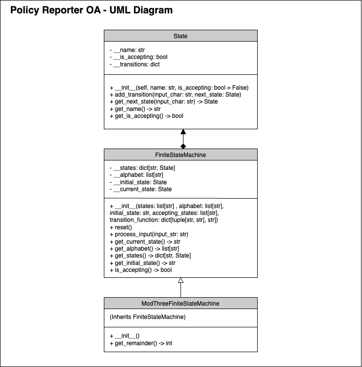

## Overview:

The API is for Policy Reporter's Online Assessment. The objective is to determine the remainder when dividing a number by 3 using a finite state machine implementation.

You can run some examples in `main.py`; run the command `python3 -m main` on Mac or `py -m main` on Windows. Tests for the classes can be found in respective files within the `tests` directory and the implementation of the classes can be found within the `src` directory.

Edit the examples list in `main.py` to test different examples.

## How to run tests:

To run all the tests:

- Mac: `python3 -m unittest discover -s tests -p "*.py"`
- Windows: `py -m unittest discover -s tests -p "*.py"`

To run tests for the `State` class:

- In the root directory run the command:
    
    Mac: `python3 -m unittest tests.TestState`
    
    Windwows: `py -m unittest tests.TestState`

To run tests for the `FiniteStateMachine` class:

- In the root directory run the command:

    Mac: `python3 -m unittest tests.TestFiniteStateMachine`
    
    Windows: `py -m unittest tests.TestFiniteStateMachine`

To run tests for the `ModThreeFSM` class:

- In the root directory run the command:

    Mac: `python3 -m unittest tests.TestModThreeFiniteStateMachine`
    
    Windows: `py -m unittest tests.TestModThreeFiniteStateMachine`

## UML:

